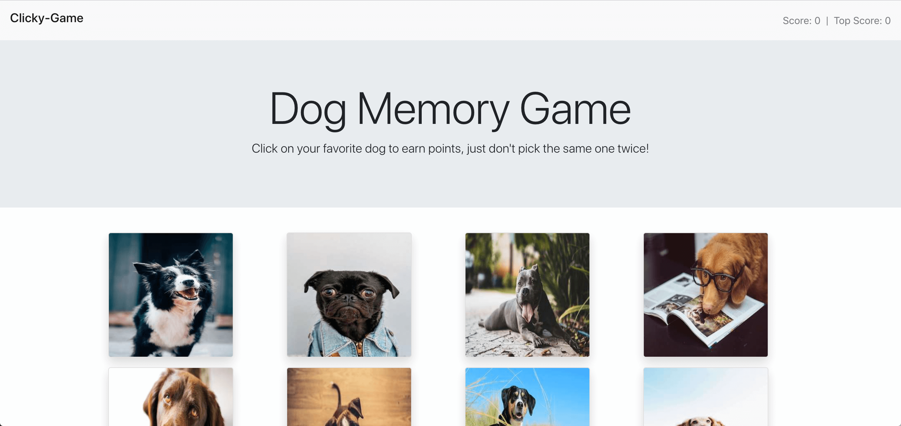

# Clicky-Game
Clicky-Game is a "memory game" web-based application using React.js

## Deployment
This app is deployed using Heroku.  Click <a href="https://clicky-app-reactapp.herokuapp.com/">here</a> to start interacting.

## Screenshot

## Tools/Technologies Used
<a href="https://reactjs.org/">React</a> 
<a href="https://www.npmjs.com/package/react-router-dom">React-Router-Dom</a> 
<a href="https://getbootstrap.com/">Bootstrap</a> 
<a href="https://yarnpkg.com">Yarn</a> 
<a href="https://www.npmjs.com/package/shuffle-array">Shuffle-array</a> 

